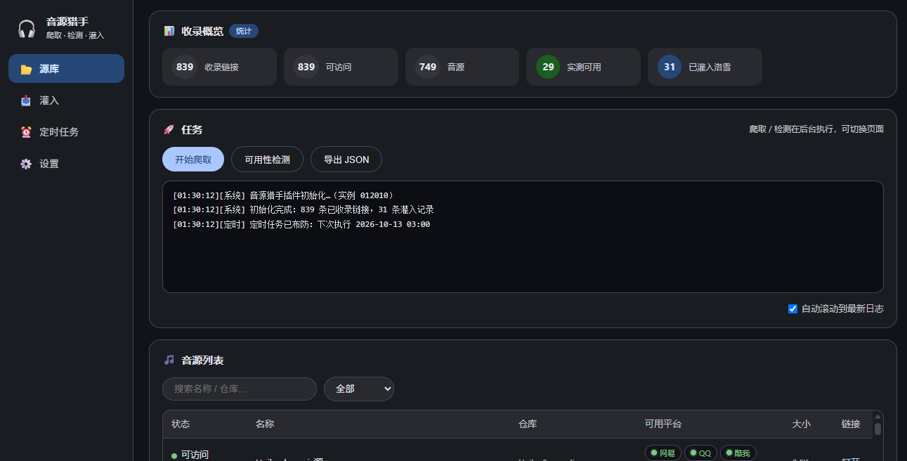
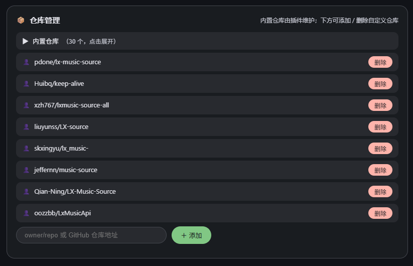
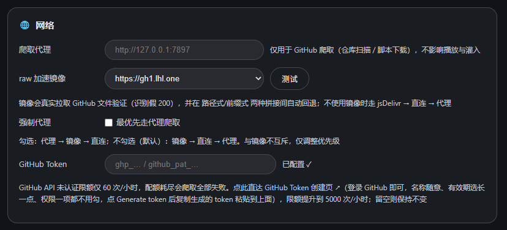

# 音源猎手 (LX Source Hunter)

Songloft (洛雪音乐宿主) JS 插件：GitHub 音源爬取、沙箱可用性检测、多选灌入洛雪音源插件并支持一键撤回。

 



## 功能

**源库**
- 爬取：扫描 30 个内置仓库 + 自定义仓库，自动提取 `.js` 音源候选链接
- 去重：以 `仓库::路径` 为主键入库，重复爬取不会膨胀
- 检测：基础探活 → 疑似音源识别 → jsenv 沙箱深度检测（真实测试歌曲逐平台发起 `musicUrl` 请求 → Range 探测 + 音频魔数校验，假链接/试听片段无法通过）
- 导出 JSON 备份

**灌入**
- 实测可用的音源列表，平台红绿灯（绿=可用 / 红=不可用 / 灰=未检测）
- 多选勾选 → 一键灌入洛雪音源插件并启用，自动记录洛雪侧音源 id
- 一键撤回：调用洛雪插件的删除接口，移除本插件灌入的音源（失效后清理用）

**设置**
- 爬取代理 / raw 加速镜像（内置 jsDelivr 自动兜底）/ 深度检测开关与单轮上限
- 仓库管理：内置仓库锁定，自定义仓库支持直接粘贴 GitHub 地址

## 安装

**方式一：插件商店（推荐）**

Songloft → 设置 → JS 插件管理 → 插件商店 → 管理订阅源 → 添加：

```
https://raw.githubusercontent.com/zlyon/lx-hunter/main/registry.json
```

**方式二：手动上传**

从 [Releases](https://github.com/zlyon/lx-hunter/releases) 下载 `lx-hunter-vX.Y.Z.jsplugin.zip`，在 Songloft 插件管理页上传。

## 使用流程

1. 「设置」页按需配置代理/镜像和自定义仓库
2. 「源库」点「开始爬取」→ 自动完成 爬取 → 基础检测 → 深度检测（一轮需几分钟）
3. 「灌入」页勾选想要的可用源 →「灌入所选」
4. 音源失效后：深度检测复跑 →「灌入」页勾选失效项 →「撤回所选」

## 推荐音源仓库

除 30 个内置仓库外，你可以在插件「设置」页的**仓库管理**中添加以下社区维护的音源仓库（输入 `owner/repo` 或完整 GitHub 地址，点「＋添加」即可）：

| 仓库 | 地址 |
|---|---|
| pdone/lx-music-source | https://github.com/pdone/lx-music-source |
| Huibq/keep-alive | https://github.com/Huibq/keep-alive |
| xzh767/lxmusic-source-all | https://github.com/xzh767/lxmusic-source-all |
| liuyunss/LX-source | https://github.com/liuyunss/LX-source |
| skxingyu/lx_music- | https://github.com/skxingyu/lx_music- |
| jeffernn/music-source | https://github.com/jeffernn/music-source |
| Qian-Ning/LX-Music-Source | https://github.com/Qian-Ning/LX-Music-Source |
| oozzbb/LxMusicApi | https://github.com/oozzbb/LxMusicApi |



也可以自行在 GitHub 搜索 `洛雪音源`、`lx-music-source`、`lxmusic source` 等关键词发现更多仓库，添加后点「开始爬取」即可纳入检测范围。

## GitHub Token 配置（推荐）

GitHub API 未认证限额仅 **60 次/小时**，限额耗尽后本轮爬取会全部失败。在插件「设置 → 网络 → GitHub Token」填入一个 Personal Access Token，限额即刻提升到 **5000 次/小时**（约 80 倍），多轮爬取、频繁复检更从容。



**获取步骤（1 分钟）**：

1. 登录 GitHub，打开 [Token 创建页](https://github.com/settings/tokens/new)
2. Note 随意填（如 `lx-hunter`），Expiration 有效期选长一点
3. **权限一项都不用勾**——此 token 仅用于提升 API 限额，读取的都是公开数据，无任何写权限
4. 点 **Generate token**，复制生成的 `ghp_...` 字符串
5. 粘贴到插件「设置 → 网络 → GitHub Token」输入框，保存即可

> 留空则保持未认证限额不变；token 只保存在你自己的 Songloft 服务端，不会上传到任何第三方。

## 注意事项

- 需要宿主已安装「洛雪音源」(lxmusic) 插件，灌入/撤回才能生效
- 权限仅申请 `storage` + `jsenv`
- 未认证 GitHub API 限速 60 次/小时（30 个内置仓库每轮正好用满，深度检测不受影响）；在「设置」页配置 GitHub Token 可提升至 5000 次/小时，见上方「GitHub Token 配置」
- 插件与洛雪音源插件互相独立，卸载互不影响

## License

GPL-3.0-or-later —— 任何人可自由使用、修改、分发本插件，但衍生作品必须同样以 GPL-3.0 开源，不得闭源换皮重发。详见 [LICENSE](LICENSE)。
